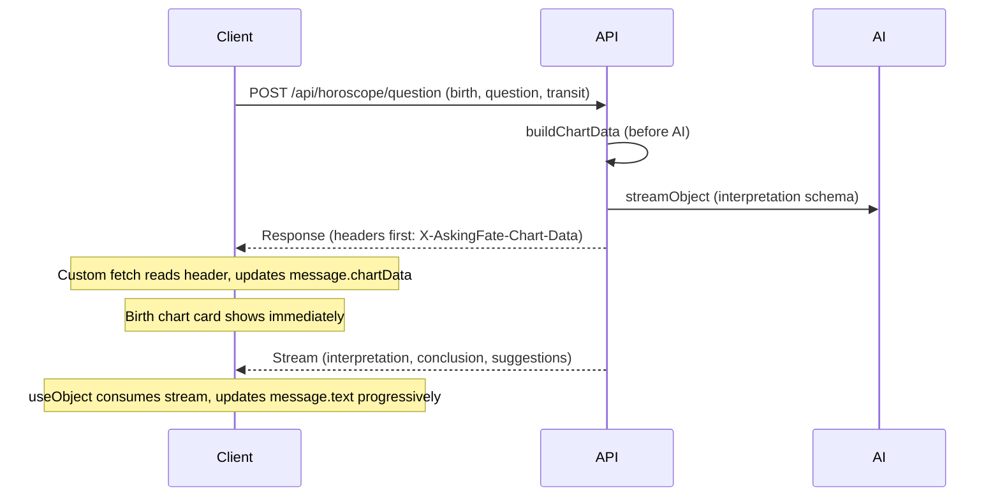

# Horoscope useObject Streaming and Early Birth Chart Display

## Current State

- **API** ([app/api/horoscope/question/route.ts](app/api/horoscope/question/route.ts)): Uses `generateObject` (blocking), returns JSON with interpretation/conclusion/suggestions. Chart data is sent in `X-AskingFate-Chart-Data` header.
- **Client** ([components/chat/session.tsx](components/chat/session.tsx)): `runHoroscopeReading` does a single fetch, waits for full response, then updates the message with both chart data and interpretation.
- **Display** ([components/chat/message-list.tsx](components/chat/message-list.tsx)): Birth chart card renders only when `message.chartData && !message.isLoading` (line 595), so it appears only after the full response.

## Reference: Object Streaming Pattern

The tarot interpretation flow uses `useObject` + `streamObject`:

- **API** ([app/api/interpret-cards/question/route.ts](app/api/interpret-cards/question/route.ts)): `streamObject` with `result.toTextStreamResponse()`
- **Client** ([components/chat/session.tsx](components/chat/session.tsx) lines 246-302): `useObject` with `api`, `schema`, `onFinish`, `onError`; streams partial `object` via `useEffect` (lines 311-339) to update the loading message

## Architecture



## Implementation Plan

### 1. API: Switch to streamObject and Send Chart Data in Headers

**File:** [app/api/horoscope/question/route.ts](app/api/horoscope/question/route.ts)

- Replace `generateObject` with `streamObject` (same pattern as [app/api/interpret-cards/question/route.ts](app/api/interpret-cards/question/route.ts))
- Keep `chartDataResult` from `buildChartData` (already computed before the AI call)
- Return `result.toTextStreamResponse()` but wrap it to add `X-AskingFate-Chart-Data` header with base64-encoded chart data
- Headers are sent before the body stream, so the client can read chart data as soon as the response starts

```ts
// Pseudocode
const result = await streamObject({
    model,
    schema,
    system,
    prompt,
    temperature,
})
const streamRes = result.toTextStreamResponse()
const chartDataB64 = Buffer.from(JSON.stringify(chartDataResult)).toString(
    "base64",
)
return new Response(streamRes.body, {
    status: streamRes.status,
    headers: new Headers({
        ...Object.fromEntries(streamRes.headers),
        "X-AskingFate-Chart-Data": chartDataB64,
    }),
})
```

### 2. Client: Add useObject for Horoscope with Custom Fetch

**File:** [components/chat/session.tsx](components/chat/session.tsx)

- Add a new `useObject` hook for horoscope (similar to tarot `submitInterpretation` / `interpretationObject`)
- Use `horoscopeInterpretationSchema` from [lib/astrology/schema.ts](lib/astrology/schema.ts)
- Provide a custom `fetch` that:
    1. Calls the real fetch
    2. Reads `X-AskingFate-Chart-Data` from response headers
    3. Parses and calls a callback (e.g. `onChartData`) to update the message with `chartData` immediately
    4. Returns the original response so useObject can consume the body stream
- Use a ref (e.g. `horoscopeLoadingIdRef`) to know which message to update when chart data arrives
- Add `useEffect` to sync `object` (interpretation, conclusion, suggestions) to the horoscope message while streaming
- Add `onFinish` to set `isLoading: false` and finalize the message
- Add `onError` for error handling and abort support

### 3. Refactor runHoroscopeReading to Use useObject

**File:** [components/chat/session.tsx](components/chat/session.tsx)

- Replace the direct `fetch` in `runHoroscopeReading` with a call to the horoscope `useObject.submit()`
- Pass body: `{ question, birth, transit, conversationContext, locale, system }` (matching the API request schema)
- Set `horoscopeLoadingIdRef.current = loadingId` before submit
- Wire `horoscopeAbortRef` to `stop` from useObject for cancel support

### 4. Display: Show Birth Chart Card as Soon as chartData Exists

**File:** [components/chat/message-list.tsx](components/chat/message-list.tsx)

- Change condition from `message.chartData && !message.isLoading` to `message.chartData` (line 595)
- Birth chart card will render as soon as chart data is set (from headers), even while interpretation is still streaming

### 5. Handle refetchHoroscopeWithSystem

**File:** [components/chat/session.tsx](components/chat/session.tsx)

- `refetchHoroscopeWithSystem` currently does a direct fetch and expects JSON + chart header
- Update it to either:
    - Reuse the same useObject flow (submit with new system, target the existing message), or
    - Keep a separate fetch path that consumes the new stream format and reads chart data from headers
- Simpler approach: trigger the same useObject submit with the new system and the message’s birth/transit/question, and update that message (may need to support “refetch mode” in the flow)

### 6. Imports and Schema

- Add `streamObject` from `"ai"` in the horoscope API
- Add `horoscopeInterpretationSchema` import in session.tsx (if not already present)
- Ensure `useObject` is used with the correct schema for the streaming response

## Key Files

| File                                                                       | Changes                                                                                                          |
| -------------------------------------------------------------------------- | ---------------------------------------------------------------------------------------------------------------- |
| [app/api/horoscope/question/route.ts](app/api/horoscope/question/route.ts) | `generateObject` → `streamObject`, add chart data header to response                                             |
| [components/chat/session.tsx](components/chat/session.tsx)                 | New useObject for horoscope, custom fetch for chart header, refactor runHoroscopeReading, sync object to message |
| [components/chat/message-list.tsx](components/chat/message-list.tsx)       | Show BirthChartCard when `message.chartData` (remove `!message.isLoading`)                                       |

## Edge Cases

- **Abort**: Use `stop` from useObject and `horoscopeAbortRef` to cancel; on abort, show the date form again (existing behavior)
- **Refetch with system**: Ensure chart data is still available when refetching (it comes from the same buildChartData with new system)
- **Streaming interpretation box**: Display `object.interpretation` (and conclusion/suggestions) progressively as they stream, mirroring the tarot interpretation box behavior
