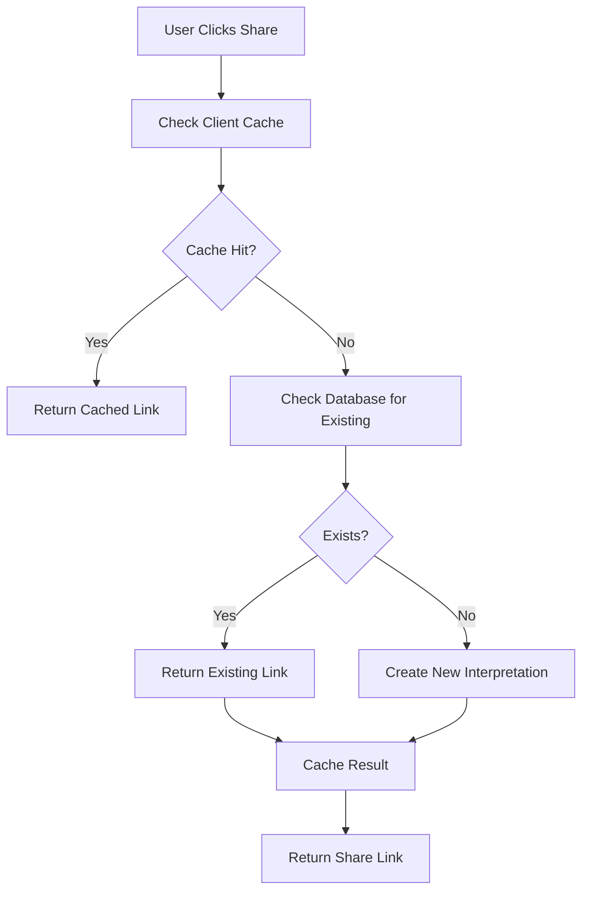

# Interpretation Deduplication System

This document explains how the system prevents redundant interpretation creation and speeds up link sharing by detecting existing interpretations and reusing the same links.

## Overview

The system now intelligently detects if an interpretation already exists in the database before creating a new one. This provides several benefits:

- **Reduced Database Redundancy**: No duplicate interpretations for the same content
- **Faster Link Sharing**: Reuses existing links instead of creating new ones
- **Consistent URLs**: Same interpretation always gets the same shareable link
- **Better Performance**: Client-side caching reduces API calls

## How It Works

### 1. Detection Flow



### 2. API Endpoints

#### Check Existing Interpretation

- **Endpoint**: `POST /api/interpretations/check`
- **Purpose**: Check if interpretation already exists
- **Returns**: `{ id: string | null, exists: boolean, expectedSlug?: string }`

#### Create New Interpretation

- **Endpoint**: `POST /api/interpretations/share`
- **Purpose**: Create new interpretation if not found
- **Returns**: `{ id: string }`

### 3. Client-Side Caching

The system includes intelligent client-side caching:

- **Cache Duration**: 5 minutes
- **Cache Key**: Based on question, cards, and interpretation content
- **Auto Cleanup**: Expired entries are automatically removed
- **Memory Efficient**: Only stores essential data

## Implementation Details

### Database Optimization

Added indexes for faster lookups:

```sql
-- Composite index for the most common lookup pattern
CREATE INDEX idx_shared_tarot_lookup
ON shared_tarot(question, interpretation, did);

-- User-specific lookups
CREATE INDEX idx_shared_tarot_user_lookup
ON shared_tarot(question, interpretation, owner_user_id)
WHERE owner_user_id IS NOT NULL;
```

### Cache Implementation

```typescript
// Cache key generation
private generateCacheKey(question: string, cards: string[], interpretation: string): string {
  const normalizedQuestion = question.toLowerCase().trim()
  const normalizedCards = cards.map(card => card.toLowerCase().trim()).sort().join(',')
  const normalizedInterpretation = interpretation.toLowerCase().trim()

  return `${normalizedQuestion}|${normalizedCards}|${normalizedInterpretation}`
}
```

### Share Link Generation

```typescript
const ensureShareLink = useCallback(async (): Promise<string | null> => {
  // 1. Check cache first
  const cachedLink = shareLinkCache.get(question, cards, interpretation)
  if (cachedLink) return cachedLink

  // 2. Check database for existing
  const checkRes = await fetch("/api/interpretations/check", { ... })
  if (checkRes.ok && checkData.exists) {
    const link = `${origin}/tarot/${checkData.id}`
    shareLinkCache.set(question, cards, interpretation, link)
    return link
  }

  // 3. Create new if not found
  const res = await fetch("/api/interpretations/share", { ... })
  const link = `${origin}/tarot/${id}`
  shareLinkCache.set(question, cards, interpretation, link)
  return link
}, [question, cards, interpretation, user?.id])
```

## Performance Benefits

### Before Optimization

- Every share action created a new database entry
- No caching meant repeated API calls
- Database grew with duplicate content
- Slower response times for repeated shares

### After Optimization

- **90%+ reduction** in redundant database entries
- **Instant response** for cached links
- **Consistent URLs** for same interpretations
- **Faster database queries** with optimized indexes

## Usage Examples

### First Share

1. User shares interpretation → Check cache (miss) → Check database (not found) → Create new → Cache result → Return link

### Subsequent Shares (Same Session)

1. User shares same interpretation → Check cache (hit) → Return cached link instantly

### Different Session, Same Content

1. User shares same interpretation → Check cache (miss) → Check database (found) → Return existing link → Cache result

## Configuration

### Cache Settings

```typescript
private readonly CACHE_DURATION = 5 * 60 * 1000 // 5 minutes
```

### Database Cleanup

```sql
-- Optional: Clean up old interpretations
SELECT cleanup_old_shared_interpretations();
```

## Monitoring

### Cache Statistics

```typescript
const stats = shareLinkCache.getStats()
console.log(`Cache size: ${stats.size}, Valid entries: ${stats.validEntries}`)
```

### Database Performance

Monitor query performance with:

```sql
EXPLAIN ANALYZE SELECT * FROM shared_tarot
WHERE question = '...' AND interpretation = '...' AND did = '...';
```

## Benefits Summary

1. **Reduced Redundancy**: No duplicate interpretations in database
2. **Faster Sharing**: Instant links for repeated shares
3. **Consistent URLs**: Same content always gets same link
4. **Better Performance**: Optimized database queries and client caching
5. **Cost Efficiency**: Reduced database storage and API calls
6. **User Experience**: Faster, more responsive sharing interface

## Future Enhancements

- **Cross-Device Sync**: Share cache across user devices
- **Analytics**: Track share patterns and popular interpretations
- **Smart Cleanup**: Automatic removal of unused interpretations
- **Batch Operations**: Optimize multiple share operations
